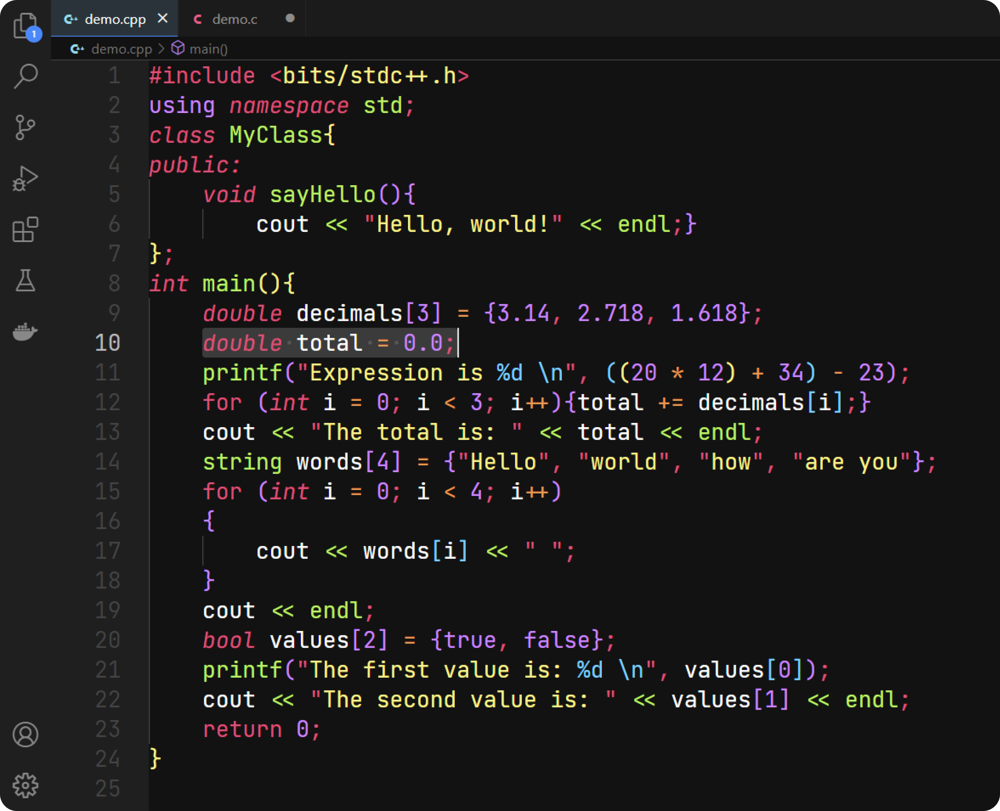

# **Heptico Theme**

A modern and minimalistic dark theme for VS Code, with subtle contrasts and elegant colors, optimized for coding.

|
## **Installation**

Paste the following command and press enter to install Heptico Theme in VS Code

`ext install TathyaPatel.heptico`

Or install it manually by

Step 1: Open the Extensions Tab from the sidebar.\
Step 2: Search for Heptico Theme.\
Step 3: Press Install (and Reload).\
Step 4: `ctrl + shift + P` and type `Color Theme`.\
Step 5: Scroll down to find Heptico Theme from the list and press Enter.\
Step 6: Enjoy your new theme!!!

## **Palette**

|Colours|Hex|RGB|CMYK|HSL|Palette|
|---|---|---|---|---|---|
|Brink Pink|`#FC517C`|`252 81 124`|`0 65 51 1`|`345 97 65`|.png)|
|Bright Lilac|`#DF87FF`|`223 135 255`|`13 47 0 0`|`284 100 76`|.png)|
|Vivid Sky Blue|`#4CCFFF`|`76 207 255`|`70 19 0 0`|`196 100 65`|.png)|
|Inchworm Green|`#A6F05F`|`166 240 95`|`31 0 60 6`|`91 83 66`|.png)|
|Yellow Crayola|`#FFF387`|`255 243 135`|`0 5 47 0`|`54 100 76`|.png)|
|Deep Saffron|`#FF994C`|`255 153 76`|`0 40 70 0`|`26 100 65`|.png)|
|White|`#FFFFFF`|`255 255 255`|`0 0 0 0`|`0 0 100`|.png)|
|Background|`#121212`|`18 18 18`|`0 0 0 93`|`0 0 7`|.png)|
|Comments|`#676767`|`103 103 103`|`0 0 0 60`|`0 0 40`|.png)|

## **Note**

Currently optimised for C and C++.\
More languages will be supported soon.\
A review or a rating for the theme would be appreciated.
